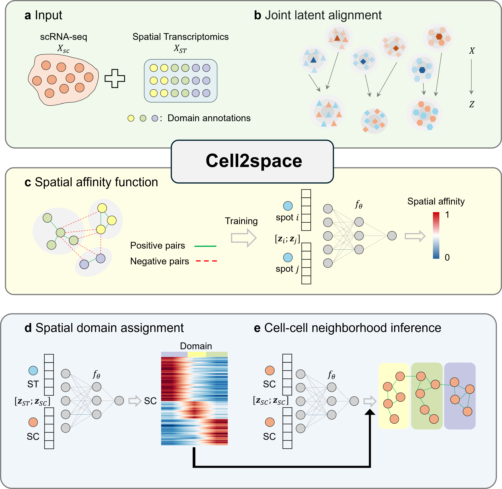

# Cell2space

**Stepwise multi-scale reconstruction of cell spatial organization from single-cell RNA sequencing data.**


## 📖 Overview

**Cell2space** is a deep learning framework designed to reconstruct multi-scale cell spatial organization from scRNA-seq data. Unlike methods that predict absolute coordinates, Cell2space optimizes a **universal spatial affinity function**. It adopts a hierarchical inference strategy:
1. **Macro-scale**: Assigns single cells to broad spatial domains.
2. **Micro-scale**: Refines these assignments to infer fine-grained cell-cell neighborhood relationships.

### Workflow
<div align="center">
  
</div>

<div align="left">
  <b>Figure 1: Cell2space Framework.</b> (a) Input scRNA-seq and ST data. (b) Latent space alignment via Harmony. (c) Learning spatial affinity via MLP. (d) Spatial domain assignment. (e) Neighborhood inference.
</div>

## 🛠 Installation

### 1. Requirements
- Python 3.8+
- PyTorch
- Scanpy
- AnnData
- Harmony-pytorch
- Scikit-learn

### 2. Setup
```bash
git clone https://github.com/SDU-Math-SunLab/Cell2space.git
cd Cell2space
pip install -r requirements.txt
```

---

## 🚀 Quick Start

### 1. Data Preparation
Prepare your scRNA-seq and Spatial Transcriptomics (ST) data as `AnnData` objects. Ensure your ST data includes spatial domain labels in `adata.obs`.

### 2. Run the Full Pipeline
You can run the integrated pipeline provided in `main.py`. This includes data integration, model training, domain assignment, and spatial cell-cell neighborhood relationship inference.

```bash
python main.py
```

### 💡 Core Workflow
You can integrate Cell2space into your analysis pipeline. The typical workflow consists of four main steps:

```python
from utils import preprocess, create_distance_matrix
from model import MLP
# 1. Preprocessing: Select common HVGs and align datasets
adata_sc, adata_st = preprocess(adata_sc, adata_st, select_hvg='union')

# 2. Integration: Use Harmony to project data into a shared latent space
# (Refer to main.py for the full Harmony integration code)

# 3. Training: Train the MLP to learn spatial affinity from ST references
# mlp = MLP(input_dim)
# ... training logic ...

# 4. Mapping: Assign single cells to spatial domains & infer neighborhoods
# predicted_domains, prob_matrix = mapper.predict_domains(sc_features, st_features, st_domains)
```


---
## ✍️ Citation
The manuscript for **Cell2space** is currently in preparation. If you use this tool in your research, please cite this repository:

**Cell2space: Stepwise multi-scale reconstruction of cell spatial organization from single-cell RNA sequencing data**  
Jieyi Pan, Qiyuan Guan, and Duanchen Sun.  

